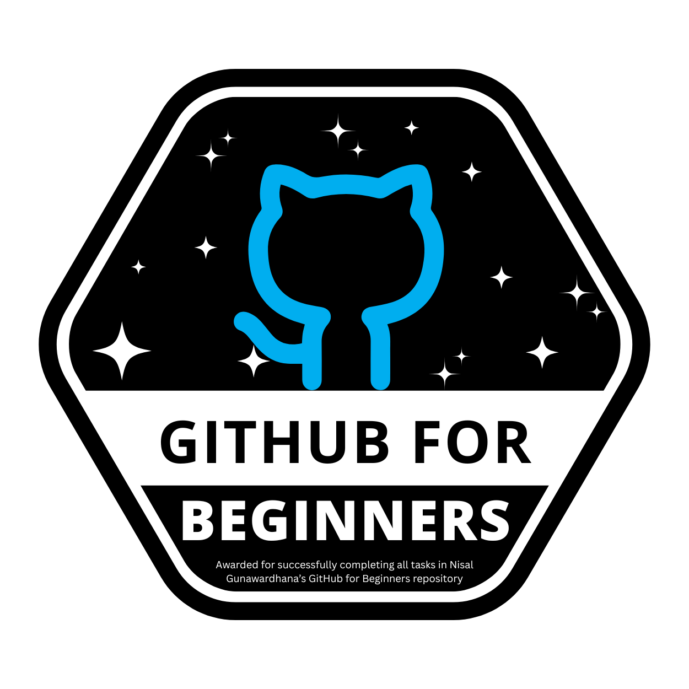
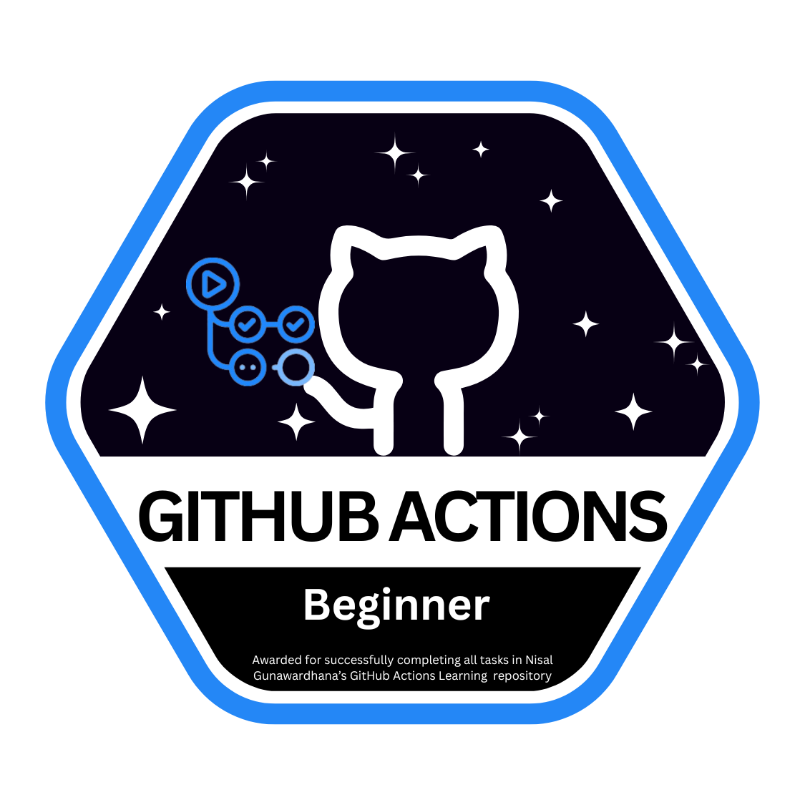
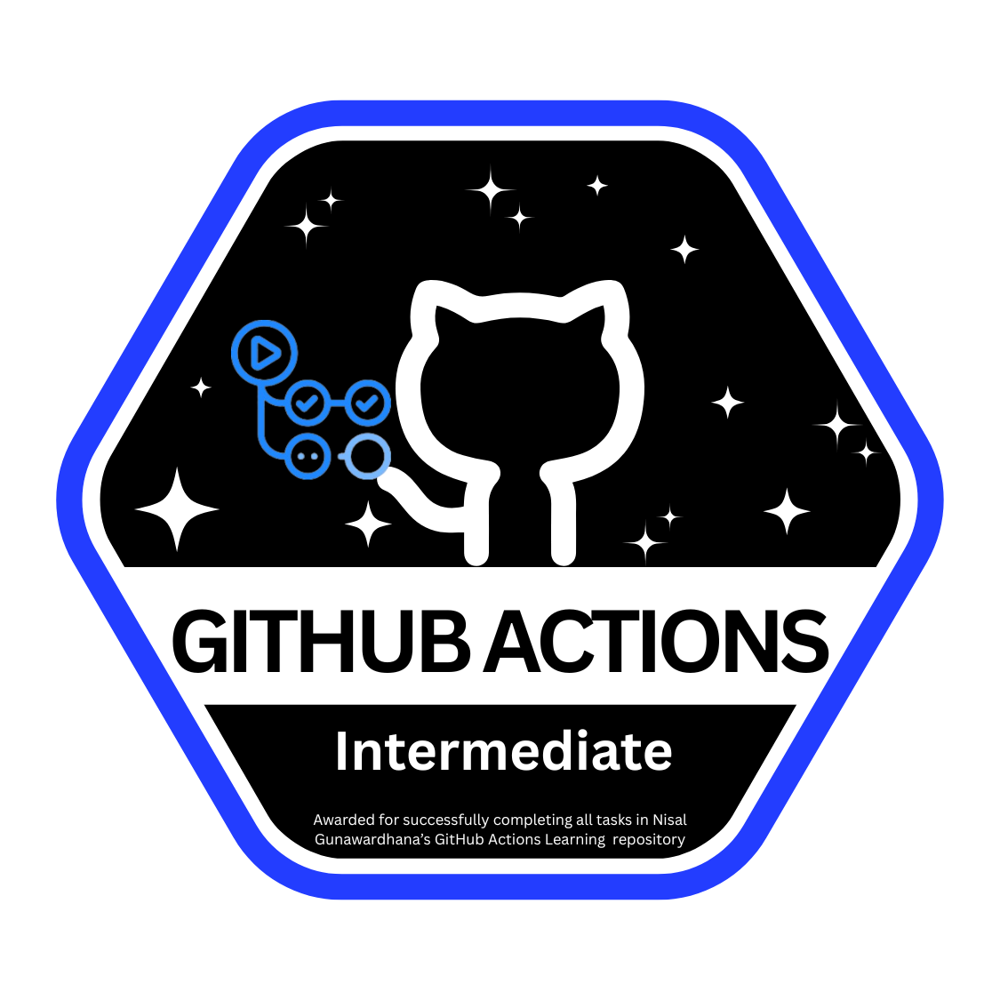
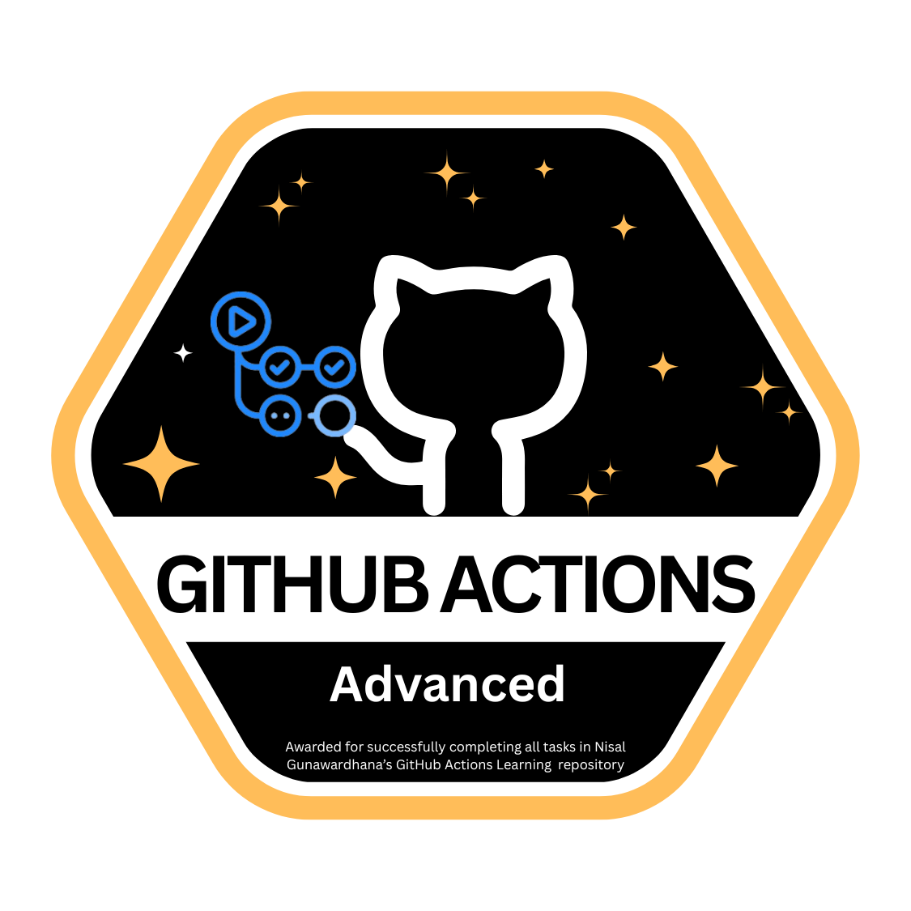

# 🎉 Dev Learning Badges

This repository showcases my learning achievements across **GitHub Actions, Docker, APIs, and GitHub beginner skills**.

---

## 🎖️ All Badges

<p>
  
  
  
  
  
  
</p>

---

## 🛠️ Tasks Completed

See detailed task breakdown:  
- [GitHub Beginner Tasks](badges/GitHub-Beginner.md)
- [GitHub Actions Tasks](badges/Github-Action.md)  
- [Docker Tasks](badges/Docker.md)  
- [API Tasks](badges/API.md)  


---

## 📁 Project Structure

```text
dev-learning-badges/
│
├── images/                  ← Badges images folder
│   ├── Github-For-Beginner.png
│   ├── Github-Action-Beginner.png
│   ├── Github-Action-Intermediate.png
│   ├── Github-Action-Advanced.png
│   ├── Docker.png
│   └── API.png
│
├── badges/                  ← Individual badge/task files (Markdown)
│   ├── Github-Beginner.md   ← GitHub beginner tasks details
│   ├── Github-Actions.md    ← GitHub Actions tasks details
│   ├── Docker.md            ← Docker tasks details
│   └── API.md               ← API tasks details
│
├── .github/                 ← GitHub Actions workflows
│   └── workflows/
│
├── README.md                ← Main README (overview + GitHub Actions badges + links to individual badges)
```

---

## 🎖️ My Badges & Progress

Below are the tasks I have completed and the badges I have earned. This section also includes links to my Pull Requests and evidence of my work as proof of progress.

| Badge | Task Description | Status | Proof (PR / Issue) |
| :---: | :--- | :---: | :--- |
|  | **GitHub 101 - GitHub For Beginners** | ✅ Completed | [PR #453](https://github.com/nisalgunawardhana/Github-for-beginners/pull/453) / [Issue #454](https://github.com/nisalgunawardhana/Github-for-beginners/issues/454) |
|  | **GitHub Action Learning Beginners** | ✅ Completed | [PR #93](https://github.com/nisalgunawardhana/github-actions-learning/pull/93) / [Issue #95](https://github.com/nisalgunawardhana/github-actions-learning/issues/95) |
|  | **GitHub Action Learning Intermediate** | ✅ Completed | [PR #104](https://github.com/nisalgunawardhana/github-actions-learning/pull/104) / [Issue #105](https://github.com/nisalgunawardhana/github-actions-learning/issues/105) |
|  | **GitHub Action Learning Advanced** | ✅ Completed | [PR #122](https://github.com/nisalgunawardhana/github-actions-learning/pull/122) / [Issue #123](https://github.com/nisalgunawardhana/github-actions-learning/issues/123) |
|  | **Docker 101** | 📝 Planned | *Coming Soon* |
|  | **API Learning 101** | 📝 Planned | *Coming Soon* |


---

## 📚 Learning References & Resources
This project is part of a learning journey based on the following repositories. All credits go to the original author for the excellent content.

* **GitHub 101 - GitHub For Beginners:** [nisalgunawardhana/Github-for-beginners](https://github.com/nisalgunawardhana/Github-for-beginners)
* **GitHub Actions Learning:** [nisalgunawardhana/github-actions-learning](https://github.com/nisalgunawardhana/github-actions-learning)
* **Docker 101:** [nisalgunawardhana/docker-101](https://github.com/nisalgunawardhana/docker-101)
* **API Learning 101:** [nisalgunawardhana/api-learning-101](https://github.com/nisalgunawardhana/api-learning-101)

---

## 👤 Credits
Special thanks to **[Nisal Gunawardhana](https://github.com/nisalgunawardhana)** for these amazing resources and for guiding the community.

> **Note:** This is a fork of the original learning materials, maintained for personal progress and documentation.

---
