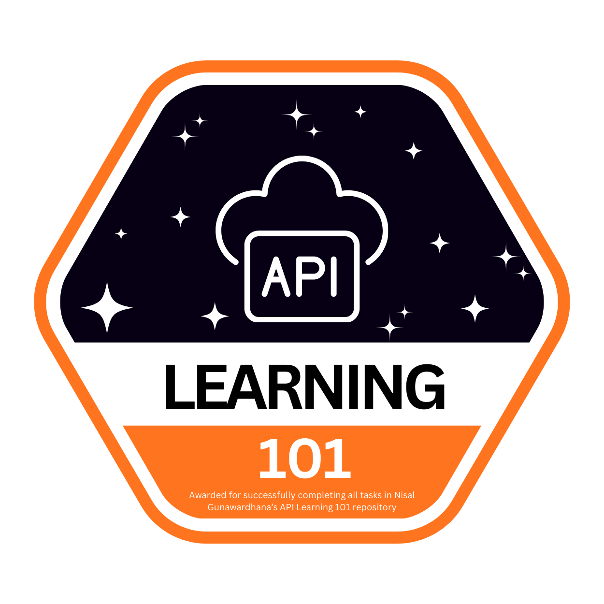

# 🌐 API Learning 101 Journey

This section documents my progress in mastering API fundamentals and RESTful architecture using the [API Learning 101](https://github.com/nisalgunawardhana/api-learning-101) curriculum.

---

## 📚 What You'll Learn
Through this module, I covered essential hands-on skills in API testing and development:
* **API Fundamentals:** Understanding HTTP Methods (GET, POST, PUT, DELETE), Status Codes, and REST Principles.
* **Postman Workflows:** Managing Environment variables, Collections, and automated API assertions.
* **Testing & Validation:** Testing CRUD operations, validation handling (422), duplicate detection (409), and 404 error cases.
* **Live API Integration:** Executing requests against a live production REST API backend.

---

## 🛠️ Tasks Completed
I have successfully implemented, tested, and verified all 13 API test scenarios:

### 1. Root & Retrieval
* [✅] **Task 1:** Root Endpoint Verification (`01-root-endpoint.png`)
* [✅] **Task 2:** GET All Users (`02-get-all-users.png`)
* [✅] **Task 3:** GET User by ID (`03-get-user-by-id.png`)
* [✅] **Task 4:** GET User - 404 Error Handling (`04-get-user-404.png`)

### 2. Create Operations & Validations
* [✅] **Task 5:** POST Create User - Success 201 (`05-create-user-success.png`)
* [✅] **Task 6:** POST Create User - 422 Validation Error (`06-create-user-validation-error.png`)
* [✅] **Task 7:** POST Create User - 409 Duplicate Email Error (`07-create-user-duplicate-email.png`)
* [✅] **Task 8:** POST Create User - 400 Missing Fields Error (`08-create-user-missing-fields.png`)

### 3. Update & Delete Operations
* [✅] **Task 9:** PUT Update User - Success 200 (`09-update-user-success.png`)
* [✅] **Task 10:** PUT Update User - 404 Not Found (`10-update-user-not-found.png`)
* [✅] **Task 11:** PUT Update User - 422 Validation Error (`11-update-user-validation.png`)
* [✅] **Task 12:** DELETE User - Success 200 (`12-delete-user-success.png`)
* [✅] **Task 13:** DELETE User - 404 Not Found (`13-delete-user-not-found.png`)

---

## 🎖️ My Badges & Progress
Below is the visual representation of my progress for the API module.

| Badge | Task Description | Status | Proof (PR / Issue) |
| :---: | :--- | :---: | :--- |
|  | **API Learning 101** | ✅ Completed | [PR #646](https://github.com/nisalgunawardhana/api-learning-101/646) / [Issue #647](https://github.com/nisalgunawardhana/api-learning-101/647) |

---

## 👤 Credits & Acknowledgement
This learning path and curriculum were provided by **[Nisal Gunawardhana](https://github.com/nisalgunawardhana)**. 

Special thanks for providing the live REST API server and Postman learning resources.